<picture>
  <source media="(prefers-color-scheme: dark)" srcset="./dark.svg">
  <source media="(prefers-color-scheme: light)" srcset="./light.svg">
  
</picture>

## Backend development & system design

I'm **Hossam Hassan**. I build backend APIs with **Node.js, NestJS and TypeScript**, with a focus on data modeling, background processing and performance. I also have foundational knowledge of AI-assisted development and AI integrations.

## Technology stack

### Backend & APIs

  <picture><source media="(prefers-color-scheme: dark)" srcset="./assets/skills/dark/nodejs.svg"><source media="(prefers-color-scheme: light)" srcset="./assets/skills/light/nodejs.svg"></picture>
  <picture><source media="(prefers-color-scheme: dark)" srcset="./assets/skills/dark/nestjs.svg"><source media="(prefers-color-scheme: light)" srcset="./assets/skills/light/nestjs.svg"></picture>
  <picture><source media="(prefers-color-scheme: dark)" srcset="./assets/skills/dark/express.svg"><source media="(prefers-color-scheme: light)" srcset="./assets/skills/light/express.svg"></picture>
  <picture><source media="(prefers-color-scheme: dark)" srcset="./assets/skills/dark/bullmq.svg"><source media="(prefers-color-scheme: light)" srcset="./assets/skills/light/bullmq.svg"></picture>
  <picture><source media="(prefers-color-scheme: dark)" srcset="./assets/skills/dark/rest-apis.svg"><source media="(prefers-color-scheme: light)" srcset="./assets/skills/light/rest-apis.svg"></picture>
  <picture><source media="(prefers-color-scheme: dark)" srcset="./assets/skills/dark/jwt.svg"><source media="(prefers-color-scheme: light)" srcset="./assets/skills/light/jwt.svg"></picture>
  <picture><source media="(prefers-color-scheme: dark)" srcset="./assets/skills/dark/websockets.svg"><source media="(prefers-color-scheme: light)" srcset="./assets/skills/light/websockets.svg"></picture>

### Databases & persistence

  <picture><source media="(prefers-color-scheme: dark)" srcset="./assets/skills/dark/postgresql.svg"><source media="(prefers-color-scheme: light)" srcset="./assets/skills/light/postgresql.svg"></picture>
  <picture><source media="(prefers-color-scheme: dark)" srcset="./assets/skills/dark/mongodb.svg"><source media="(prefers-color-scheme: light)" srcset="./assets/skills/light/mongodb.svg"></picture>
  <picture><source media="(prefers-color-scheme: dark)" srcset="./assets/skills/dark/mongoose.svg"><source media="(prefers-color-scheme: light)" srcset="./assets/skills/light/mongoose.svg"></picture>
  <picture><source media="(prefers-color-scheme: dark)" srcset="./assets/skills/dark/prisma.svg"><source media="(prefers-color-scheme: light)" srcset="./assets/skills/light/prisma.svg"></picture>
  <picture><source media="(prefers-color-scheme: dark)" srcset="./assets/skills/dark/sequelize.svg"><source media="(prefers-color-scheme: light)" srcset="./assets/skills/light/sequelize.svg"></picture>
  <picture><source media="(prefers-color-scheme: dark)" srcset="./assets/skills/dark/redis.svg"><source media="(prefers-color-scheme: light)" srcset="./assets/skills/light/redis.svg"></picture>
  <picture><source media="(prefers-color-scheme: dark)" srcset="./assets/skills/dark/postgis.svg"><source media="(prefers-color-scheme: light)" srcset="./assets/skills/light/postgis.svg"></picture>
  <picture><source media="(prefers-color-scheme: dark)" srcset="./assets/skills/dark/pgvector.svg"><source media="(prefers-color-scheme: light)" srcset="./assets/skills/light/pgvector.svg"></picture>

### Cloud & delivery

  <picture><source media="(prefers-color-scheme: dark)" srcset="./assets/skills/dark/docker.svg"><source media="(prefers-color-scheme: light)" srcset="./assets/skills/light/docker.svg"></picture>
  <picture><source media="(prefers-color-scheme: dark)" srcset="./assets/skills/dark/docker-compose.svg"><source media="(prefers-color-scheme: light)" srcset="./assets/skills/light/docker-compose.svg"></picture>
  <picture><source media="(prefers-color-scheme: dark)" srcset="./assets/skills/dark/git.svg"><source media="(prefers-color-scheme: light)" srcset="./assets/skills/light/git.svg"></picture>
  <picture><source media="(prefers-color-scheme: dark)" srcset="./assets/skills/dark/github-actions.svg"><source media="(prefers-color-scheme: light)" srcset="./assets/skills/light/github-actions.svg"></picture>
  <picture><source media="(prefers-color-scheme: dark)" srcset="./assets/skills/dark/aws.svg"><source media="(prefers-color-scheme: light)" srcset="./assets/skills/light/aws.svg"></picture>

### Languages & web

  <picture><source media="(prefers-color-scheme: dark)" srcset="./assets/skills/dark/typescript.svg"><source media="(prefers-color-scheme: light)" srcset="./assets/skills/light/typescript.svg"></picture>
  <picture><source media="(prefers-color-scheme: dark)" srcset="./assets/skills/dark/javascript.svg"><source media="(prefers-color-scheme: light)" srcset="./assets/skills/light/javascript.svg"></picture>
  <picture><source media="(prefers-color-scheme: dark)" srcset="./assets/skills/dark/html5.svg"><source media="(prefers-color-scheme: light)" srcset="./assets/skills/light/html5.svg"></picture>
  <picture><source media="(prefers-color-scheme: dark)" srcset="./assets/skills/dark/css.svg"><source media="(prefers-color-scheme: light)" srcset="./assets/skills/light/css.svg"></picture>
  <picture><source media="(prefers-color-scheme: dark)" srcset="./assets/skills/dark/tailwindcss.svg"><source media="(prefers-color-scheme: light)" srcset="./assets/skills/light/tailwindcss.svg"></picture>
  <picture><source media="(prefers-color-scheme: dark)" srcset="./assets/skills/dark/react.svg"><source media="(prefers-color-scheme: light)" srcset="./assets/skills/light/react.svg"></picture>

### AI foundations

  <picture><source media="(prefers-color-scheme: dark)" srcset="./assets/skills/dark/llm-apis.svg"><source media="(prefers-color-scheme: light)" srcset="./assets/skills/light/llm-apis.svg"></picture>
  <picture><source media="(prefers-color-scheme: dark)" srcset="./assets/skills/dark/rag.svg"><source media="(prefers-color-scheme: light)" srcset="./assets/skills/light/rag.svg"></picture>
  <picture><source media="(prefers-color-scheme: dark)" srcset="./assets/skills/dark/mcp.svg"><source media="(prefers-color-scheme: light)" srcset="./assets/skills/light/mcp.svg"></picture>
  <picture><source media="(prefers-color-scheme: dark)" srcset="./assets/skills/dark/embeddings.svg"><source media="(prefers-color-scheme: light)" srcset="./assets/skills/light/embeddings.svg"></picture>
  <picture><source media="(prefers-color-scheme: dark)" srcset="./assets/skills/dark/tool-calling.svg"><source media="(prefers-color-scheme: light)" srcset="./assets/skills/light/tool-calling.svg"></picture>
  <picture><source media="(prefers-color-scheme: dark)" srcset="./assets/skills/dark/context-engineering.svg"><source media="(prefers-color-scheme: light)" srcset="./assets/skills/light/context-engineering.svg"></picture>

### Engineering foundations

  <picture><source media="(prefers-color-scheme: dark)" srcset="./assets/skills/dark/system-design.svg"><source media="(prefers-color-scheme: light)" srcset="./assets/skills/light/system-design.svg"></picture>
  <picture><source media="(prefers-color-scheme: dark)" srcset="./assets/skills/dark/microservices.svg"><source media="(prefers-color-scheme: light)" srcset="./assets/skills/light/microservices.svg"></picture>
  <picture><source media="(prefers-color-scheme: dark)" srcset="./assets/skills/dark/data-structures.svg"><source media="(prefers-color-scheme: light)" srcset="./assets/skills/light/data-structures.svg"></picture>
  <picture><source media="(prefers-color-scheme: dark)" srcset="./assets/skills/dark/testing.svg"><source media="(prefers-color-scheme: light)" srcset="./assets/skills/light/testing.svg"></picture>
  <picture><source media="(prefers-color-scheme: dark)" srcset="./assets/skills/dark/networking.svg"><source media="(prefers-color-scheme: light)" srcset="./assets/skills/light/networking.svg"></picture>
  <picture><source media="(prefers-color-scheme: dark)" srcset="./assets/skills/dark/cicd.svg"><source media="(prefers-color-scheme: light)" srcset="./assets/skills/light/cicd.svg"></picture>

---

**How I work:** requirements & constraints → API contracts & data models → implementation → tests & review → deployment.

## A closer look

<strong>Backend, architecture & databases</strong>

- **Languages & frameworks:** JavaScript, TypeScript, Node.js, NestJS and Express.
- **API engineering:** HTTP, REST, status codes, API contracts, validation, pagination, filtering, sessions, JWT, refresh tokens and rate limiting.
- **Database tooling:** PostgreSQL, MongoDB, Mongoose, Prisma and Sequelize; geospatial queries with PostGIS and GiST indexes.
- **Data design:** SQL vs. NoSQL trade-offs, schemas, indexes, query optimization, migrations, schema evolution, transactions, isolation levels and bottleneck analysis.
- **System design:** requirements, constraints, back-of-the-envelope estimates, microservices, synchronous/asynchronous communication and multi-region architecture concepts.
- **Application structure:** MVC, service layers, clean architecture, clean functions and SOLID fundamentals.
- **Backend features:** payment integration, BullMQ background jobs, worker queues and Redis caching strategies.

<strong>Testing, deployment & AWS</strong>

- **Testing:** unit and integration tests, mocking and stubs, integration vs. E2E concepts, benchmarking and performance testing.
- **Delivery:** Git workflows, GitHub Actions, CI/CD, Docker, Docker Compose and development/staging/production environments.
- **Observability:** structured logging, monitoring, error handling and backend debugging.
- **AWS foundations:** EC2, S3, CloudFront, RDS, DynamoDB, ElastiCache, ECS, VPC, Auto Scaling and load balancing.

<strong>AI-assisted development & AI backend foundations</strong>

My AI knowledge covers development workflows and the foundations of integrating AI into backend applications.

- **Specs as the source of truth:** requirements, user stories, API contracts, schema plans, auth/validation rules, acceptance criteria and task breakdowns.
- **Context engineering:** architecture docs, database rules, API conventions, testing strategy, agent instructions, project knowledge bases and reusable skills.
- **Coding agents:** local/cloud agents, issue-to-PR workflows, parallel tasks, isolated branches and CI checks, with human responsibility for decisions, diff review and verification.
- **LLM APIs:** chat endpoints, message roles, streaming, conversation history, token/cost tracking, rate limits, retries and timeouts.
- **Semantic search & RAG:** embeddings, vector similarity, document ingestion, extraction, chunking, metadata, retrieval, ranking, answer generation and citations; vector database and pgvector concepts.
- **Tools & MCP:** tool calling, backend tools, MCP client/server concepts, permission checks, approval flows and action logs.
- **AI delivery concerns:** prompt versioning, logging, monitoring, evaluation basics, model fallbacks, tenant isolation, prompt injection awareness and deployment considerations.

<strong>Networking, data structures & algorithms</strong>

- **Networking:** TCP vs. UDP, DNS, HTTP, reverse proxies, load balancers and WebSockets vs. HTTP polling.
- **Caching:** client, server and database caching, Redis strategies and rate limiting.
- **DSA:** Big O, arrays, hash tables, stacks, queues, BFS/DFS, sorting, two-pointer and sliding-window techniques.
- **Backend applications:** grouping, aggregation, parsing, data lookups and caching logic.

<strong>Frontend foundations</strong>

HTML, CSS, JavaScript, TypeScript and Tailwind CSS, with **basic React** knowledge.

---

[**Explore my repositories →**](https://github.com/hossamHassan-dev?tab=repositories)
